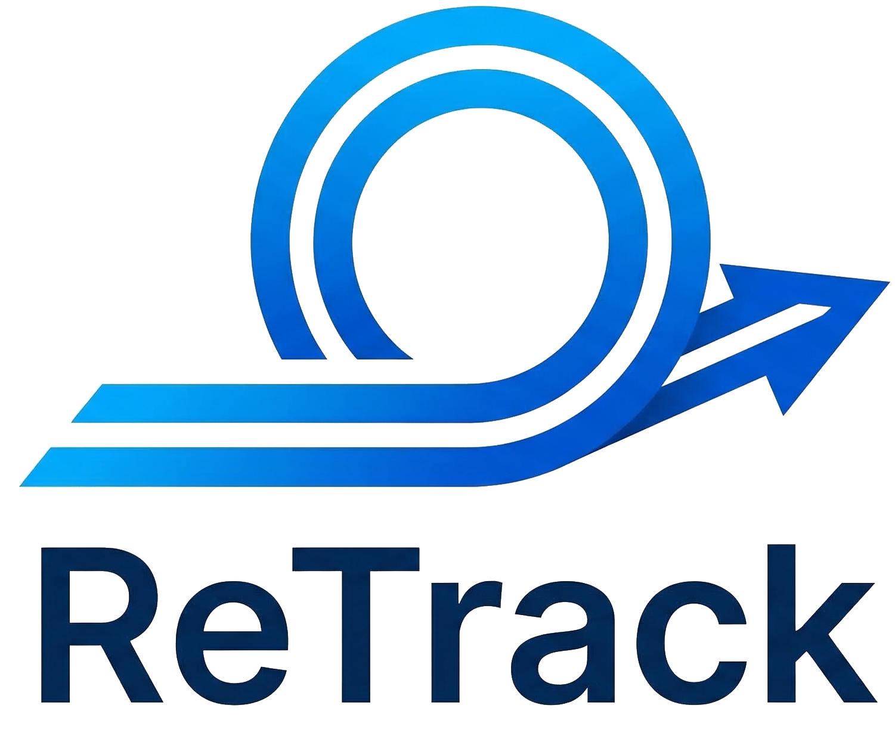
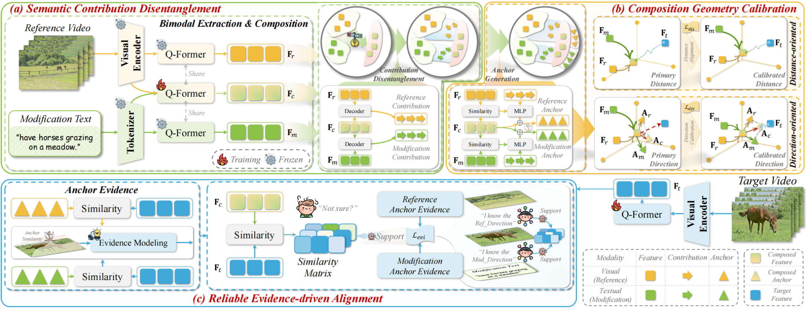
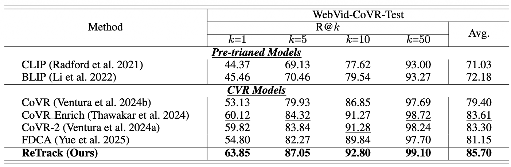
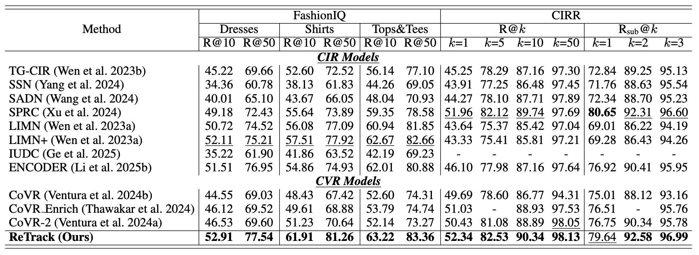

<a id="top"></a>
<div align="center">
  
  <h1>🎬 (AAAI 2026) ReTrack: Evidence-Driven Dual-Stream Directional Anchor Calibration Network for Composed Video Retrieval</h1>
  
  <p>
    <a href="https://aaai.org/Conferences/AAAI-26/"></a>
    <a href="https://arxiv.org/abs/coming soon"></a>
    <a href="coming soon"></a>
    <a href=""></a>
    <a href="https://lee-zixu.github.io"></a>
    <a href="https://pytorch.org/get-started/locally/"></a>
    
    <a href="https://github.com/Lee-zixu/ReTrack"></a>
  </p>

  <p>
    <b>Accepted by AAAI 2026:</b> An evidence-driven framework tackling both the 🎬 <b>Composed Video Retrieval (CVR)</b> and 🌁 <b>Composed Image Retrieval (CIR)</b> tasks.
  </p>
</div>


## 📖 Introduction

**ReTrack** is an advanced open-source PyTorch framework designed to improve multi-modal query understanding by calibrating directional bias in composed features. It achieves state-of-the-art (SOTA) performance across both **Composed Video Retrieval (CVR)** and **Composed Image Retrieval (CIR)** benchmarks. 

[⬆ Back to top](#top)

## 📢 News
- **[2026-03-19]** 🚀 Released all training and evaluation codes for ReTrack.
- **[2025-11-08]** 🔥 Our paper *"ReTrack: Evidence-Driven Dual-Stream Directional Anchor Calibration Network for Composed Video Retrieval"* has been accepted by **AAAI 2026**!

[⬆ Back to top](#top)

## ✨ Key Features

- 🎯 **Dual-Stream Directional Anchor Calibration**: Explicitly identifies and calibrates visual and textual semantic contributions to resolve directional bias in multi-modal composition.
- ⚖️ **Reliable Evidence-Driven Alignment**: Leverages Dempster-Shafer Theory to evaluate similarity reliability, greatly reducing uncertainty caused by highly similar retrieval candidates.
- 🧩 **Unified Framework**: Built on top of **BLIP-2** (via the [Salesforce LAVIS](https://github.com/salesforce/LAVIS) library), seamlessly supporting both video (CVR) and image (CIR) retrieval tasks.
- ⚙️ **Modular & Scalable**: Entirely managed by **Hydra** and **Lightning Fabric** for flexible configuration, easy hyperparameter overrides, and scalable multi-GPU training.

[⬆ Back to top](#top)


## 🏗️ Architecture

<p align="center">
  
  <figcaption><strong>Figure 1.</strong> The proposed ReTrack consists of three key modules: (a) Semantic Contribution Disentanglement, (b) Composition Geometry Calibration, and (c) Reliable Evidence-driven Alignment. </figcaption>
</p>

[⬆ Back to top](#top)

## 🏃‍♂️ Experiment-Results

### CVR Task Performance


<caption><strong>Table 1.</strong> Performance comparison on the test set of the CVR dataset, WebVid-CoVR, relative to R@k(%). The overall best results are in bold, while the best results over baselines are underlined.</caption>




### CIR Task Performance
<caption><strong>Table 2.</strong> Performance comparison on the CIR dataset, FashionIQ and CIRR, relative to R@k(%). The overall best results are in bold, while the best results over baselines are underlined.</caption>



[⬆ Back to top](#top)

## Table of Contents

- [Introduction](#-introduction)
- [News](#-news)
- [Key Features](#-key-features)
- [Architecture](#️-architecture)
- [Experiment Results](#️-experiment-results)
- [Quick Start & Installation](#-quick-start--installation)
- [Repository Structure](#-repository-structure)
- [Configuration Overview](#️-configuration-overview)
- [Data Preparation](#️-data-preparation)
- [Training](#️-training)
- [Evaluation/Testing](#-evaluation--testing)
- [Output & Checkpoints](#-output--checkpoints)
- [Acknowledgement](#-acknowledgements)
- [Contact](#️-contact)
- [Citation](#️-citation)
- [Support & Contributing](#-support--contributing)


## 🚀 Quick Start & Installation

We recommend using Anaconda to manage your environment following **[CoVR-Project](https://github.com/lucas-ventura/CoVR)**. *Note: This project was developed and tested with **Python 3.8** and **PyTorch 2.1.0**.*

```bash
# 1. Clone the repository
git clone https://github.com/Lee-zixu/ReTrack.git
cd ReTrack

# 2. Create a virtual environment
conda create -n retrack python=3.8 -y
conda activate retrack

# 3. Install PyTorch (Adjust CUDA version based on your hardware)
conda install pytorch torchvision torchaudio pytorch-cuda=11.8 -c pytorch -c nvidia

# 4. Install other dependencies
pip install -r requirements.txt
```

[⬆ Back to top](#top)

## 📂 Repository Structure

Our codebase is highly modular. Here is a brief overview of the core files and directories:

```text
ReTrack/
├── configs/               # ⚙️ Hydra configuration files (data, model, trainer, etc.)
├── src/                   # 🧠 Source code (dataloaders, model implementations, testing)
├── train_CVR.py           # ▶️ Training entry point for WebVid-CoVR
├── train_CIR.py           # ▶️ Training entry point for FashionIQ & CIRR
├── test.py                # 🧪 Evaluation entry point
└── requirements.txt       # 📦 Project dependencies
```
[⬆ Back to top](#top)


## ⚙️ Configuration Overview

All hyperparameters and paths are managed by **Hydra** under the `configs/` directory. The key configuration groups are:

- `configs/data/` — Dataset loaders and dataset-specific path definitions.
- `configs/model/` — Model architecture, checkpoints, optimizers, schedulers, and loss functions.
- `configs/trainer/` — Lightning Fabric training settings (devices, precision, checkpointing).
- `configs/machine/` — Hardware/Machine settings (batch size, num workers, default root paths).
- `configs/test/` — Evaluation presets across different test splits.

[⬆ Back to top](#top)

## 🗃️ Data Preparation

By default, the datasets are expected to be placed under a common root directory (e.g., `/root/autodl-tmp/data/`). 

> 💡 **Path Configuration:** You must adjust these paths for your local setup. There are two recommended ways to do this:</br>
> 1. **Edit YAML directly (Preferred):** Modify `configs/machine/default.yaml` or the specific files in `configs/data/*.yaml`.</br>
> 2. **Override via CLI:** Append `machine.default.datasets_dir=/path/to/data` to your run commands.


### 1. Composed Video Retrieval (CVR)
**Dataset:** [WebVid-CoVR](https://github.com/lucas-ventura/CoVR)

Expected directory structure (`configs/data/webvid-covr.yaml`):
```text
datasets_dir/
└── WebVid-CoVR/
    ├── videos/
    │   ├── 2M/
    │   └── 8M/
    └── annotation/
        ├── webvid2m-covr_train.csv
        ├── webvid8m-covr_val.csv
        └── webvid8m-covr_test.csv
```

### 2. Composed Image Retrieval (CIR)
**Datasets:** [FashionIQ](https://github.com/XiaoxiaoGuo/fashion-iq) and [CIRR](https://github.com/Cuberick-Orion/CIRR)

Expected directory structure:
```text
datasets_dir/
├── FashionIQ/
│   ├── captions/
│   │   ├── cap.dress.[train|val|test].json
│   │   └── ...
│   ├── image_splits/
│   │   ├── split.dress.[train|val|test].json
│   │   └── ...
│   ├── dress/
│   ├── shirt/
│   └── toptee/
└── CIRR/
    ├── train/
    ├── dev/
    ├── test1/
    └── cirr/
        ├── captions/
        │   └── cap.rc2.[train|val|test1].json
        └── image_splits/
            └── split.rc2.[train|val|test1].json
```

[⬆ Back to top](#top)

## ▶️ Training

You can easily override hyperparameters, datasets, and paths directly from the command line using Hydra syntax.

### Train CVR Model (WebVid-CoVR)
```bash
python train_CVR.py
```

### Train CIR Model (FashionIQ or CIRR)
```bash
python train_CIR.py
```

> ⚠️ Before running CIR training, make sure to update the dataset selection in `configs/train_CIR.yaml` (`data` and `test` in `defaults`) to your target dataset (e.g. `fashioniq` or `cirr`).
>
> For example:
> ```yaml
> defaults:
>   - data: fashioniq
>   - test: fashioniq
> ```
> or:
> ```yaml
> defaults:
>   - data: cirr
>   - test: cirr-all
> ```

[⬆ Back to top](#top)


## 🧪 Evaluation / Testing

To evaluate a trained model, use `test.py` and specify the target benchmark.

```bash
python test.py
```
*(Make sure to specify the dataset and path to your trained checkpoint via the config overrides or by updating the relevant `configs/test/*.yaml` file).*

[⬆ Back to top](#top)


## 📌 Output & Checkpoints

Hydra automatically manages your experiment logs and weights. 
- Outputs are systematically written to: `outputs/<dataset>/<model>/<ckpt>/<experiment>/<run_name>/`.
- Checkpoints are saved inside the run directory as `ckpt_last.ckpt` (or `ckpt_<epoch>.ckpt` if configured via `save_ckpt=all`).

[⬆ Back to top](#top)


## 🤝 Acknowledgements

This codebase is built upon several great open-source projects. We thank the authors of:
- **[CoVR](https://github.com/lucas-ventura/CoVR)** and **[CoVR-2](https://github.com/lucas-ventura/CoVR/tree/master)** for the foundational Composed Video Retrieval baselines and datasets.
- **[LAVIS](https://github.com/salesforce/LAVIS)** for providing robust Vision-Language models like BLIP-2.

[⬆ Back to top](#top)

## ✉️ Contact
For any questions, issues, or feedback, please open an [issue](https://github.com/Lee-zixu/ReTrack/issues) on GitHub or reach out to me at lizixu.cs@gmail.com.

[⬆ Back to top](#top)

## 📝⭐️ Citation

If you find our work or this code useful in your research, please consider leaving a **Star**⭐️ or **Citing**📝 our paper 🥰. Your support is our greatest motivation!


```bibtex
@inproceedings{ReTrack,
  title={ReTrack: Evidence Driven Dual Stream Directional Anchor Calibration Network for Composed Video Retrieval},
  author={Li, Zixu and Hu, Yupeng and Chen, Zhiwei and Huang, Qinlei and Qiu, Guozhi and Fu, Zhiheng and Liu, Meng},
  booktitle={Proceedings of the AAAI Conference on Artificial Intelligence},
  year={2026}
}
```

[⬆ Back to top](#top)

## 🫡 Support & Contributing

We welcome all forms of contributions! If you have any questions, ideas, or find a bug, please feel free to:
- Open an [Issue](https://github.com/Lee-zixu/ReTrack/issues) for discussions or bug reports.
- Submit a [Pull Request](https://github.com/Lee-zixu/ReTrack/pulls) to improve the codebase.

[⬆ Back to top](#top)


<div align="center">
  

  <br><br>

  <a href="https://github.com/Lee-zixu/ReTrack">
    
  </a>
  <a href="https://github.com/Lee-zixu/ReTrack/issues">
    
  </a>
  <a href="https://github.com/Lee-zixu/ReTrack/pulls">
    
  </a>

  <br><br>
<a href="https://github.com/Lee-zixu/ReTrack">
    
  </a>
</div>
